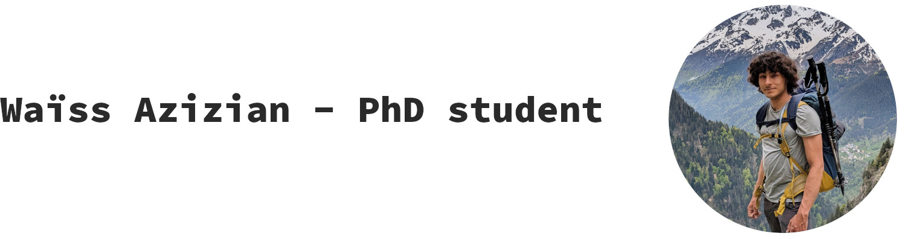

{: width="1500"}

<!-- Welcome to [Waïss Azizian](https://wazizian.fr)'s personal website! -->

### About
I am a PhD student in machine learning and optimization in Grenoble. I have the honour of having the amazing trio [Franck Iutzeler](https://www.iutzeler.org/), [Jérôme Malick](https://membres-ljk.imag.fr/Jerome.Malick/) and [Panayotis Mertikopoulos](https://polaris.imag.fr/panayotis.mertikopoulos/) as adviors. More precisely, I am at the [LJK lab](https://www-ljk.imag.fr/), which is part of [UGA](https://www.univ-grenoble-alpes.fr/).
I had the chance to study at [ENS Paris](https://www.ens.psl.eu/) and to graduate from the [MVA master](https://www.master-mva.com/).

See [arXiv](https://arxiv.org/a/azizian_w_1.html), [Google Scholar](https://scholar.google.fr/citations?user=oXxTTe8AAAAJ&hl=fr), [DBLP](https://dblp.org/pid/243/3135.html), [Github](https://github.com/wazizian), [LinkedIn](https://www.linkedin.com/in/wa%C3%AFss-azizian-93420432b/) for more information.

### Contact
- Email: waiss (dot) azizian (at) univ-grenoble-alpes (dot) fr
- Physical: office 143, LJK lab, IMAG building.

### Research
My current interest are robust optimization, non-convex stochastic optimization and understanding LLM internal mechanisms.

#### Stochastic optimization in deep learning
In this line of work, we focus on a simple yet fundamental question: what is the long-run behaviour of stochastic gradient descent (SGD) on non-convex objectives?
In the first part,  we seek to describe the asymptotic distribution of SGD on general non-convex objectives.
Leveraging large deviation theory, we obtain a description of the invariant measure of SGD ([ICML 2024](https://arxiv.org/abs/2406.09241), [poster](pdf/poster_icml24.pdf)). This work was presented at [Thoth seminar](https://team.inria.fr/thoth/) ([slides](pdf/slides_retraite_thoth_2024.pdf)), at the [Séminaire de Statistique](https://www.lpsm.paris/seminaires/statp6p7/index) of the LPSM lab in Paris ([slides](pdf/slides_UParis_Oct_2024.pdf)) and at the [Séminaire de Probabilités et Statistiques](https://math.univ-cotedazur.fr/laboratoire/seminaires/s%C3%A9minaires-de-l%C3%A9quipe-probabilit%C3%A9s-statistiques) of the Nice University ([slides](pdf/slides_UNice_Dec_2024.pdf)).

In the second part, we focus on estimating the time it takes for SGD to reach the global minimum of a non-convex function. This reveals an intricate interplay between the loss landscape, the noise structure and the behavior of SGD ([ICML 2025](https://arxiv.org/abs/2503.16398), [poster](pdf/poster_icml25.pdf)). 

#### Internal mechanisms of Large Language Models
I had the chance of working with Michael Kirchhof, Eugene Ndiaye, Louis Bethune, Michal Klein, Pierre Ablin and Marco Cuturi while interning at [Apple Machine Learning Reserach](https://machinelearning.apple.com/). We studied how uncertainty estimates for LLMs behave under distribution shifts ([R2FM Wrokshop@ICML 2025](https://arxiv.org/pdf/2506.08572)).

#### Wasserstein Distributionnally Robust Optimization
 Inspired by the success of entropic regularization in optimal transport, we study the regularization of WDRO ([ESAIM COCV](https://arxiv.org/abs/2205.08826)).
 We also show that these estimators enjoy attractive generalization guarantees ([NeurIPS 23](https://arxiv.org/abs/2305.17076), [slides](pdf/slides_neurips_2023.pdf)).

I presented early versions of these works at [a workshop in Erice in May 2022](https://workshopsperice2022.github.io/), ([slides](pdf/slides_sicile.pdf)), and the second part at [FOCM 2023](https://focm2023.org/) in Paris, ([poster](pdf/poster_wdro.pdf)) as well at [Neurips@Paris 2023](https://neuripsinparis.github.io/neurips2023paris/) ([slides](pdf/slides_neurips_in_paris_2023.pdf)).

#### Last-iterate convergence of mirror methods
We characterize the last iterate convergence rate of mirror methods in variational inequalities as a function of the local geometry of the Bregman divergence near the solution, both in the deterministic ([to be published in SIOPT](https://arxiv.org/abs/2211.08043)) and stochastic settings ([COLT 21](https://arxiv.org/abs/2107.01906)).

The latter was presented at COLT 21 ([slides](pdf/slides_colt.pdf), [poster](pdf/poster_colt.pdf)) and at ICCOPT 22 ([slides](pdf/slides_iccopt.pdf)) while the former was presented at SMAI MODE 2024 ([slides](pdf/slides_smai_mode2024.pdf)).

#### Graph Neural Networks
With [Marc Lelarge](https://www.di.ens.fr/~lelarge/), we precisely describe the approximatyion cabapilities of invariant and equivariant graph neural networks ([ICLR 21](https://arxiv.org/abs/2006.15646)). It was presented at a [MIPT-UGA workshop](https://sites.google.com/view/mipt-uga-ai-workshop/home) and at the Thoth team seminar ([slides](pdf/slides_gnn.pdf)).

#### Smooth game optimization for Machine Learning
With [Gauthier Gidel](https://gauthiergidel.github.io/), [Ioannis Mitliagkas](https://mitliagkas.github.io/) and [Simon Lacoste-Julien](https://www.iro.umontreal.ca/~slacoste/), we propose a tight and unified analysis of gradient-based methods in games ([AISTATS 20](https://arxiv.org/abs/1906.05945), [slides](pdf/slides_aistats.pdf)) and leverage matrix iteration theory to study accelerated methods in games ([AISTATS 20](https://arxiv.org/abs/2001.00602)).

### Teaching
- Statistics for biology (second year of bachelor, 2023-2024, 2024-2025): exercise sessions (2023-2024, 2024-2025).
- Numerical optimization (first year master MSIAM): practical sessions in Python/Numpy (2022-2023) and exercise sessions (2023-2024).
- Numerical optimization (second year at ENSIMAG): practical sessions in Python/Numpy and exercise sessions (2022-2023).
- Numerical analysis (first year ENSIMAG): practical sessions in Python/Numpy (2022-2023).
